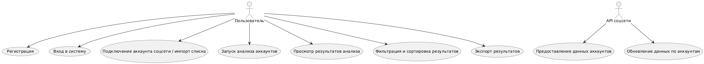

# Лабораторная работа №1

Тема: Формулирование требований к программной системе

Цель работы: Научиться анализировать поставленную задачу, формулировать функциональные и нефункциональные требования к проектируемой системе.

## Перечень заинтересованных лиц (стейкхолдеров)

* Рядовой пользователь соцсетей: человек, который хочет проверить подозрительные аккаунты и понять, кто из них может быть ботом.
* Аналитик / SMM-специалист: человек, который ведёт страницы брендов, анализирует аудиторию, качество трафика, хочет выявить ботов среди подписчиков, лайков, комментариев, чтобы оценить реальные охваты.
* Администратор сообщества в соцсетях: управляет большим сообществом, хочет выявлять и удалять ботов, чтобы уменьшить спам и накрутку лайков,комментариев и т.п.
* Системный администратор / DevOps: хочет выявить ботов, которые обращаются к системе для их автоматической блокировки на уровне сети.
* Разработчик: хочет выявить ботов, которые обращаются к системе для их автоматической блокировки на уровне приложения.

## Перечень функциональных требований

* Возможность создать учётную запись и входить в систему по логину и паролю. **Стейкхолдеры**: обычный пользователь, аналитик, администратор сообщества.
* Возможность загрузить в систему файл со списком аккаунтов. **Стейкхолдеры**: обычный пользователь, аналитик, администратор сообщества.
* Возможность выбрать один аккаунт, список аккаунтов, сообщество посредством API или через веб-интерфейс. **Стейкхолдеры**: все типы пользователей системы.
* Возможность запустить анализ посредством API или через веб-интерфейс. **Стейкхолдеры**: все типы пользователей системы.
* Возможность просмотреть результирующую таблицу с оценкой вероятности бота, основными признаками: кол-во постов, дата регистрации, частота активности и статусом. **Стейкхолдеры**: все типы пользователей системы.
* Возможность фильтровать аккаунты по диапазону вероятности бота, активности, дате создания аккаунта. **Стейкхолдеры**: все типы пользователей системы.
* Возможность экспорта результатов анализа в формат .csv и .xslx. **Стейкхолдеры**: все типы пользователей системы.

## Диаграмма вариантов использования

## Перечень сделанных предположений

* Предполагается наличие ключей доступа API и соблюдение ограничений по частоте запросов.
* Система не выполняет автоматических действий в самой соцсети.
* Пользователь согласен передавать данные о своих списках подписчиков/друзей системе.

## Перечень нефункциональных требований

* Для аккаунтов, помеченных как “вероятно бот”, доля ботов (precision) должна быть не ниже 80%.
* Система должна уметь обрабатывать до 10 000 аккаунтов за одну сессию анализа за не более чем 10 минут.
* Время отклика интерфейса должно составлять не более 3-х секунд.
* Доступ к веб-интерфейсу системы только по защищённому протоколу HTTPS.
* Пароли пользователей должны храниться в виде хэш-сумм.
* Основные действия подключения аккаунта, запуска анализа и просмотр результатов должны быть доступны не более чем в 3 клика с главной страницы.
